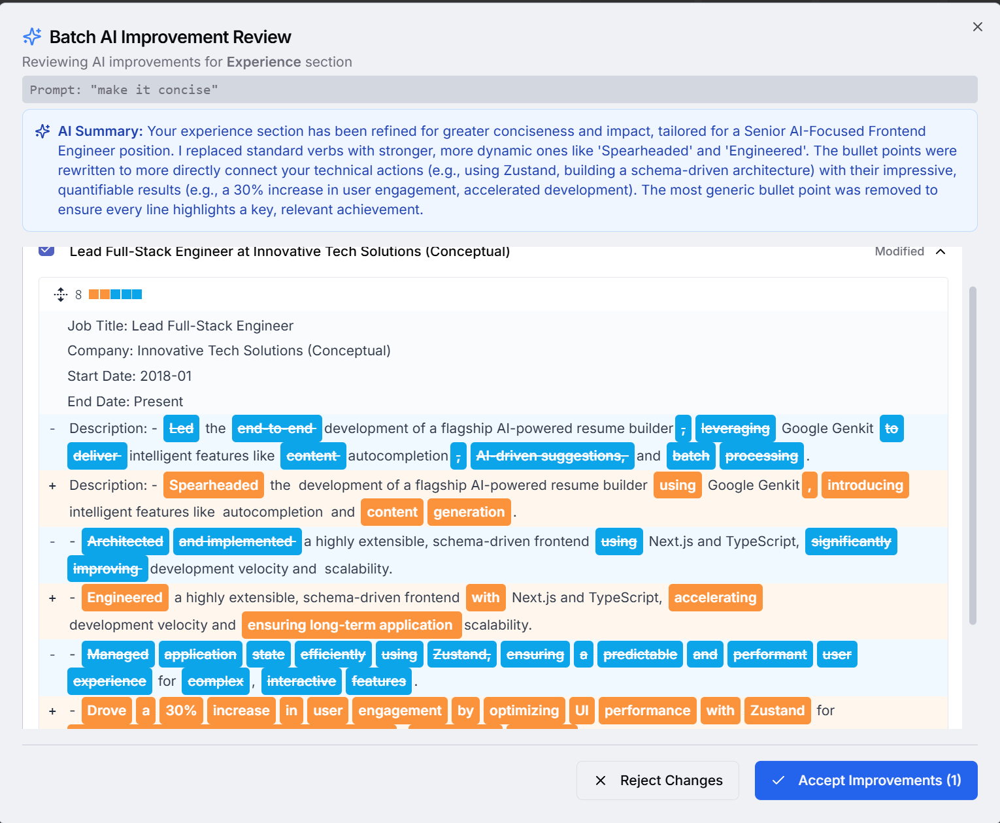

# Resume Studio - Experimental Alpha Branch

> **⚠️ WARNING: This is an experimental branch for developers only.**
>
> This branch enables direct API key input in the settings panel, offering higher performance and greater flexibility for testing various Large Language Models (LLMs).
>
> **This comes at a significant cost:**
> - **Disabled Helper Functions**: This branch sacrifices the advanced `helperFunction` capabilities of the main branch. This means prompts are less dynamic and context-aware, leading to a loss of flexibility in AI interactions.
> - **Instability**: This branch is not as stable as the main branch and is subject to breaking changes.
>
> **Use this branch ONLY for development, experimentation, or contributing to the core AI services.** For a stable, feature-complete experience, please use the `main` branch.

---

An intelligent, schema-driven resume builder powered by AI. This experimental version allows for direct interaction with LLMs via UI-configurable API keys.



## Branch-Specific Features

- **Direct API Key Configuration**: Input your API key directly in the settings panel to test different providers and models on the fly.
- **Enhanced Performance**: Bypassing some helper functions may result in faster response times from the AI services.
- **Greater LLM Extensibility**: Easier to plug in and test unsupported or custom LLMs.

## 🚀 Quick Start

### Installation

1. **Clone the repository**
   ```bash
   git clone https://github.com/superGekFordJ/Resume-studio.git
   git checkout your-experimental-branch-name
   cd Resume-studio
   ```

2. **Install dependencies**
   ```bash
   npm install
   # or
   pnpm install
   ```

3. **Start the development server**
   ```bash
   npm run dev
   # or
   pnpm dev
   ```

4. **Open your browser**
   Navigate to `http://localhost:9002` to start experimenting.

### Configuration

- Go to the **Settings Panel** in the UI.
- Select your AI provider.
- Enter your API key directly into the input field. The application will use this key for all AI operations.

> **Note**: While you can still set keys in `.env.local`, the UI-provided key will take precedence if entered.

## 📚 Core Documentation

For information on core features, architecture, and how to extend the application with new schemas or templates, please refer to the documentation available in the `docs/` directory. The principles of the schema-driven architecture and template system remain the same.

- **Architecture Guide**: `docs/architecture.md`
- **Template Creation**: `docs/ui/how-to-replicate-a-new-template.md`

## 🤝 Contributing

Contributions to this experimental branch are welcome, especially those aimed at:
- Improving the core AI service layer.
- Restoring helper function capabilities without sacrificing performance.
- Enhancing multi-provider support.

Please feel free to open issues and submit pull requests.

## 📄 License

This project is licensed under a **Non-Commercial Use License**. 

- ✅ **Free for personal, educational, and non-commercial use**
- ❌ **Commercial use requires explicit permission**
- 📧 **For commercial licensing, please contact**: [hi@fordj.me](mailto:hi@fordj.me) 